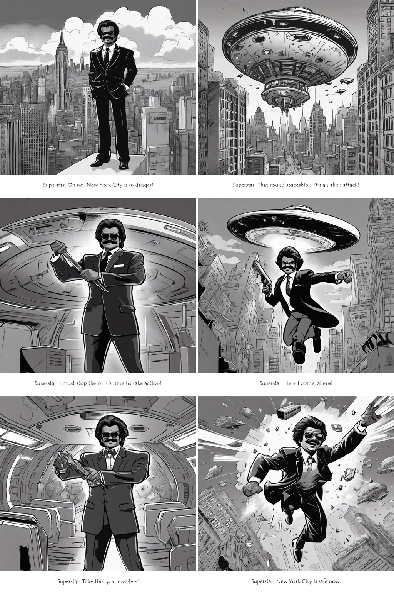

# Comics Generator

This program use Generative AI to create an entire comic strip from a short scenario.

The scenario must mention the characters with a physical description.

## How it works
First, a LLM (OpenAI API) is used to split the scenario into 6 panels with their description and associated text.

Then for each panel:
 - an image is generated with Stable Diffusion (Stability API).
 - the panel text is added to the image
The 6 generated images with their texts are then merged into a final strip !

## Lessons learnt:
Creating a consistent aesthetics through prompting throughout the comic is definitely an "art". 
Ensure your prompts are consistently supplying as much physical details about the character and the background.
In this case, the prompts for Stability is AI generated from OpenAPI - so it probably needs better prompt template to generate consistent outcomes  

## Usage

Export `OPENAI_API_KEY` and `STABILITY_KEY`.

Install dependencies: `pip install langchain openai stability-sdk pillow`

Then edit the `SCENARIO` variable in [kartoon.py](kartoon.py).  
You can also edit the `STYLE` variable to change the style.  

Run the script: `python kartoon.py`

## Examples


Style american comic

```
Characters: Superstar is a guy who looks like young Rajnikanth has a moustache and wears a black suit.
New York City is in danger of an alien attack from a Spaceship. 
Superstar the young Rajnikanth lookalike flies towards the large Alien spaceship.
Superstar the young Rajnikanth lookalike saves the day by destroying the large alien spaceship.
```


